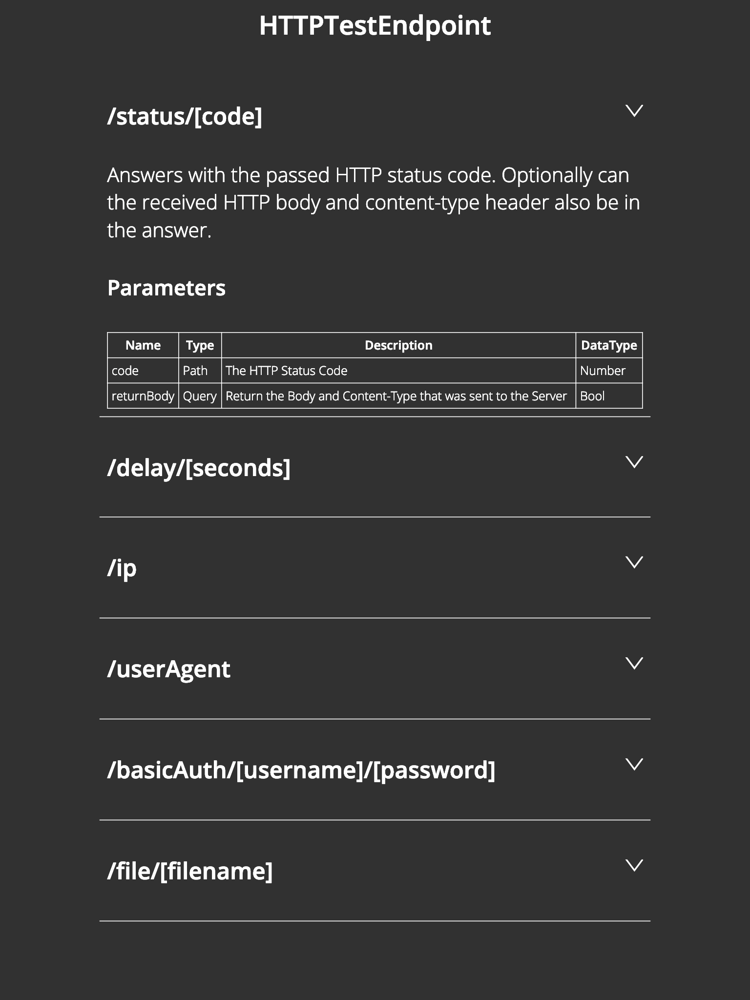

# HTTPTestEndpoint

You need to Implement a special API or want to Test how your Code acts when it receives a special HTTP Reason or HTTP Body ? Than this Tool is what you are searching for.

| URL Path                         | Description                                                  |
| -------------------------------- | ------------------------------------------------------------ |
| /status/[code]                   | Answers with the passed HTTP Status Code. Optinally can the received HTTP Body and Contant-Type Header also be in the answer. |
| /delay/[seconds]                 | Waits the passed Seconds and answer 200 OK. Optinally can the received HTTP Body and Contant-Type Header also be in the answer. |
| /ip                              | Returns the Remote IP Address in the HTTP Body.              |
| /userAgent                       | Returns the User-Agent String from the HTTP Header in the HTTP Body. |
| /basicAuth/[username]/[password] | Checks if the Username and Passwort of the Authorization are the same as the one passed in the URL Path. If yes 200 OK and if not 401 Unauthorized will be answered. |
| /file/[filename]                 | Returns the Content of the passed File in the HTTP Body. The File must be in the same Directory the HTTPTestEndpoint is. |

For more Details start the Tool and open http://localhost:8080 in your Browser to see the detailed Help Page.

